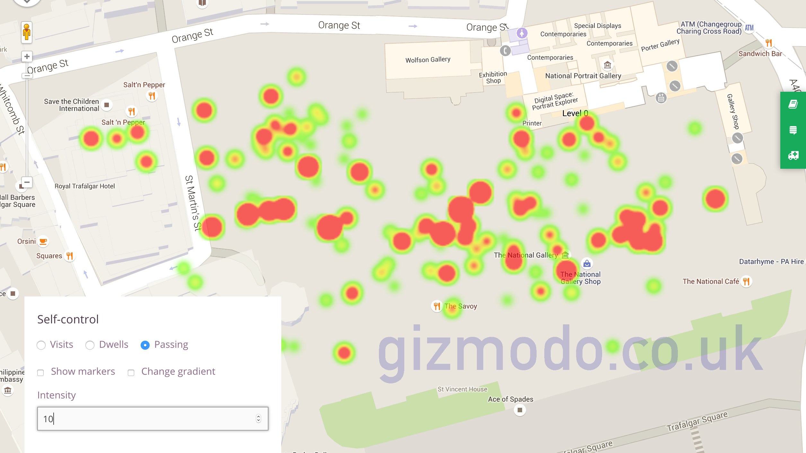
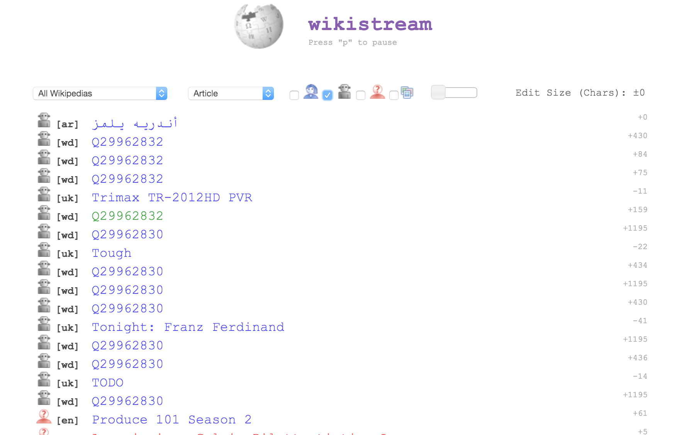
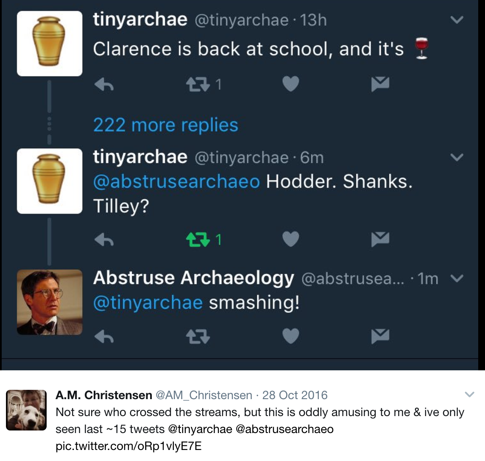
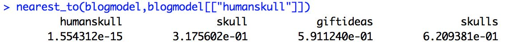
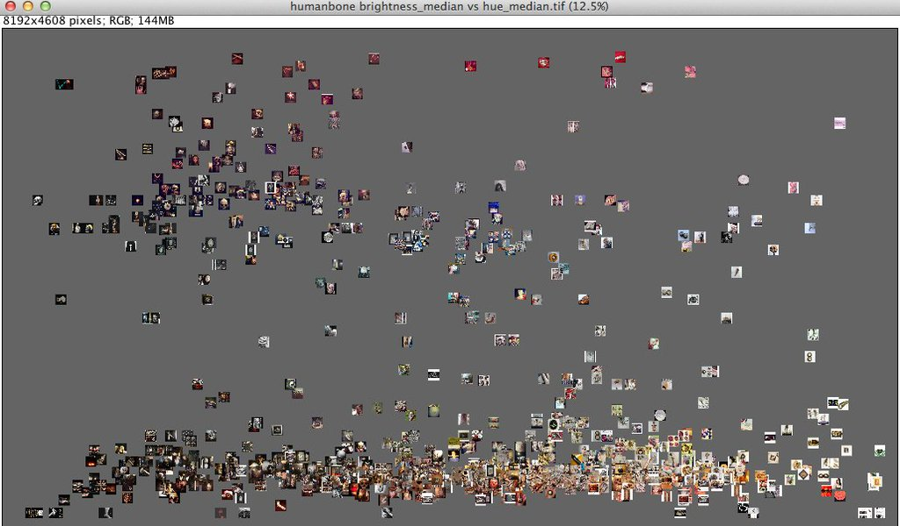
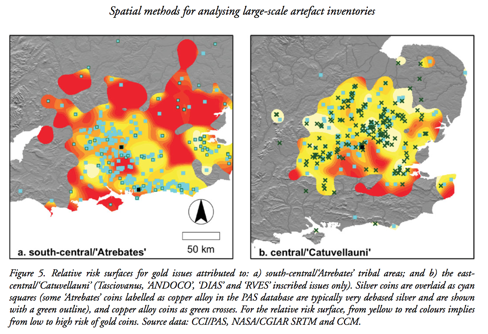
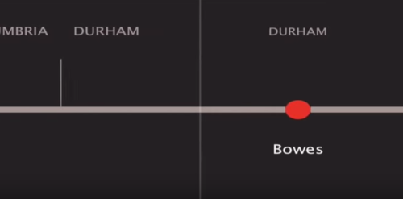
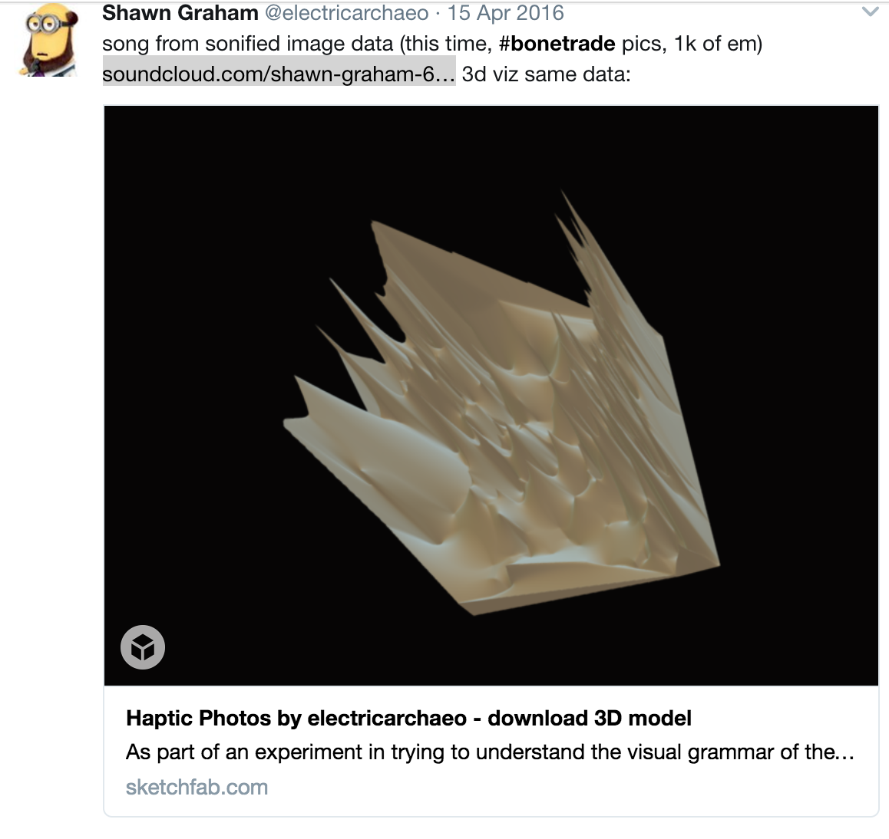

# Big Data Gothic

---

## The Plan
- what makes big data gothic
- treating humans as things
- thick data visualizations
- Big Dada
 
<small>follow along on your own device at [http://bit.ly/graham-big-data](http://bit.ly/graham-big-data)   (but be careful; some of the links open sound files)</small>

---

####[The Gothic] aimed to produce emotionally vertiginous shocks and thrills;  sensations of any kind, in fact, so long as they put the viewing subject - the 'Self' - at the centre of the experience.
 

Richard Marggraf Turley

Note:
3

---

#### "The goal  was to  overwhelm  the senses,  to annihilate  'Self'."
<section data-background="uclbigdatagothic/wanderer.jpg">
</section>

Note:
4

---

#### The world of information is more Gothic  than its believers believe,  because it is ghostly,  silhouette-like,  deprived of human sentience
 
#### Arnold Weinstein

<section data-background="uclbigdatagothic/saturn-eating-child.jpg"></section>

Note:
5

---

Note:
6. http://www.gizmodo.co.uk/2017/04/exclusive-heres-what-museums-learn-by-tracking-your-phone/

---

<h3 style="color:black"> I always feel like somebody's watching me</h3>

<section data-background="uclbigdatagothic/mirror.jpg"></section>
Note: 
7

---

### Pepperoni & Surveillance to go, please

<section data-background="uclbigdatagothic/brokenmenuscreen.png"></section>
Note:
8

---
<section data-background="uclbigdatagothic/experiment.jpg"</section>
Note:
9

---
### the technomadness of the bots
<table style="width:100%">
  <tr>
    <th></th>
    <th></th>
  <tr>
</table>

Note: 10

---

### Techno-utopianism & the obliteration of self

<section data-background="uclbigdatagothic/arcadia.jpg"></section>
Note:
11 the idea that more metrics results in better outcomes for the privileged few who live outside the algorithm, the people who own uber rather than drive for uber, or the sessional adjuncts at a former university I taught at who were scored across something called 'the Matrix' which was used to figure out who got to keep their job. Zoe Quinn: If you're not asking yourself "how could this be used to hurt someone" in your design/engineering process, you've failed. And it's not you paying for your failure. It's people who already have enough shit to deal with.

---

### The sublime ... er big data ... will save us
But probably not you, personally.

Note:
12 Kurzweil, obviously. painting: Martin Myrone encourages us to think of artistic engagement with, and deployment of, the sublime as primarily market driven, thus categorising it as a somewhat knowing and cynical enterprise. ‘The reality of commercial spectacle and sensation,’ he states, "was accommodated to a revised notion of ideal art through the eighteenth century notion of the sublime, the aesthetic celebration of grandeur and horror for its stimulation effects ... By the late eighteenth century the term had become commonplace with improvised, informal and often half-baked writing that then passed as art criticism, where it typically functioned as a ‘buzzword’ that had a certain currency without being fully theorized." He concludes that the sublime can ‘probably best be described as a certain kind of effect which had more to do with manipulating public and critical response than with attending to some pre-ordained theoretical prescription.’ http://www.tate.org.uk/art/research-publications/the-sublime/christine-riding-shipwreck-self-preservation-and-the-sublime-r1133015

---

<h3 style="color:black"> Information Asymmetry </h3>

<section data-background="uclbigdatagothic/secrets.jpg"></section>
Note:
13
Power Asymmetry

---

## Big Data Gothic
+ sublimates the human
+ revels in the glory of the [data] landscape
+ exults in the terror of it all

Note:
14

---
<section data-background="uclbigdatagothic/granny_weatherwax_by_daoyiliu-d8h0z0i.jpg">

  "It's a lot more complicated than that--"  

"No. It ain't. When people say things are a lot more  
complicated than that, they means they're getting worried  
that they won't like the truth. People as things,  
that's where it starts."  

"Oh, I'm sure there are worse crimes--"  

"But they starts with thinking about people as things..."  

Terry Pratchett, _Carpe Jugulum_

</section>

Note:
15
---

Big data, like the Gothic, lacks context.

Context forces us to _not_ think of humans as things

Note:
16. Like the sublime, we get caught up in the seductive mass of the numbers.
---

<section data-background="uclbigdatagothic/troy_pba_pottery_tent.jpg">

Let us make big data our _own_ kind of big data.  Data that remembers its humanity.

</section>
Note: 17

---
    
## When we think of humans as things
<section data-background="uclbigdatagothic/drone-on-tarmac-640x413.jpg"></section>
Note:
18 Skynet + lives as rounding errors
https://theintercept.com/document/2015/05/08/skynet-courier/
http://arstechnica.co.uk/security/2016/02/the-nsas-skynet-program-may-be-killing-thousands-of-innocent-people/

---

### Big Data Macabre:
#### Buying and Selling Human Remains on Instagram
(project lead: Damien Huffer)

Note:
19
---

Note:
20

---

 

Note:
21

---

Note:
22

---

Note:
23
---
<table style="width:100%">
  <tr>
    <th></th>
    <th></th>
    <tr>
<table>
Note:
24

---
<section data-background="uclbigdatagothic/sophie-hay2.png">
             
### Thick Data and the Fall of the House of Nokia

"They put a higher value on quantitative data, they didn't know how to handle data that wasn't easily measurable, and that didn't show up in existing reports. What could've been their competitive intelligence ended up being their eventual downfall." - [Tricia Wang](https://medium.com/ethnography-matters/why-big-data-needs-thick-data-b4b3e75e3d7#.6docngys8)

</section>
Note:
25 Complementary; Digital Humanities & Big Data balance each other

---

### Thick Archaeological Data

<section data-background="uclbigdatagothic/peanutbutter.jpg"></section>
Note:
26

---

Note:
27
---

Note:
28

---

Note:
29

---

<h3>To my GIS instructor: I am so very sorry</h3>

Note:
30

---

Note:
31

---

"People are getting caught up on the quantity side of the equation rather than the quality of the [...] insights that analytics can unearth". - Steve Maxwell

 
The word behind the elipses is 'business'. Insert your own field.

Note:
32

---

### Big Dada

<section data-background="uclbigdatagothic/MechanicalHead-Hausmann.jpg"></section>
Note: 
33

---

Listening to Watling Street

---

3d Print Sonified Images 
  sight... to sound... to touch

[BoneSong](https://w.soundcloud.com/player/?url=https%3A//api.soundcloud.com/tracks/252444364)

---

<h3 style="color:black">   so I thought to myself,  I'll make a zine,  a journal,   for this</h3>

<section data-background="uclbigdatagothic/epoiesen.png"></section>
Note: 
35

---

### When you find yourself making excuses by blaming the algorithm:
# that's Big Data Gothic

  When you find yourself liberated by digital tools to see the data in new ways,
## that's Big Dada

---

Thank you.

I'm [Shawn Graham at Carleton U](http://carleton.ca)
and [@electricarchaeo](http://twitter.com/@electricarchaeo) on Twitter
